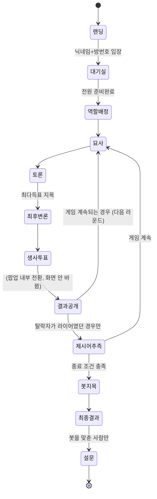

# Zeteo — 와이어프레임

> 목업이 아니라 **현재 배포된 실제 화면 구조**를 그대로 옮긴 것. 각 박스는 실제 컴포넌트/CSS 클래스와 1:1로 대응한다 (`apps/frontend/src/*.tsx`, `screens/*.tsx`).

---

## 0. 화면 전환 흐름



묘사·토론·최후변론·역할배정·생사투표·결과공개·제시어추측·봇지목 8개 페이즈는 전부 **화면 하나**(아래 2번, MainScreen) 위에 팝업만 얹혔다 사라지는 구조라, 실제로 새 화면으로 넘어가는 지점은 대기실→게임, 게임→최종결과, 최종결과→설문 세 번뿐이다.

---

## 1. 랜딩

```
┌───────────────────────────────┐
│                                 │
│          [ Zeteo 로고 ]         │
│           라이어 게임            │
│                                 │
│                                 │
│   닉네임                         │
│   [___________________]        │
│                                 │
│   방번호                         │
│   [___________________]        │
│                                 │
│                                 │
│   [        입장하기        ]     │
│                                 │
└───────────────────────────────┘
```
- 회원가입 없음, 두 입력값이 다 있어야 입장 버튼 활성화

---

## 2. 대기실 (로비)

```
┌───────────────────────────────┐
│            대기실                │
│         [ 방번호 4821 ]          │
│  ─────────────────────────────  │
│  (A) 소민 (나)         [준비완료] │
│  (B) 진               [대기]    │
│  (C) 현우              [대기]    │
│  (D) 민성              [준비완료] │
│  (E) 대기중             ─       │
│  ─────────────────────────────  │
│         2 / 4명 준비완료          │
│                                 │
│   [        준비완료         ]    │
└───────────────────────────────┘
```
- **이 화면에서만** 실제 닉네임이 노출된다 (게임 시작과 동시에 익명 라벨로 전환)
- 슬롯은 항상 5칸 고정, 빈 자리는 "대기중"으로 표시

---

## 3. 게임 화면 공통 셸 (MainScreen — 8개 페이즈가 공유)

```
┌─────────────────────────────────────────────┐
│ ZETEO   2라운드 · 토론중   묘사 3/5 ▶ C   음식/피자   ⏱ 00:47 │ ← header
├─────────────────────────────────────────────┤
│ [지목됨: C · 3표]                             │ ← finalDefense 페이즈에만
├───────────────────────────────┬───────────────┤
│  A: 저는 그거 좋아해요...         │  투표 현황     │
│  B: 나도요                      │  A ■■         │ ← zt-stage
│  C: 저는 잘 몰라요...             │  B □          │   (채팅 로그 | 투표 패널)
│  [ 팝업이 뜨면 이 영역 위에 얹힘 ]  │  C ■■■        │
│                                 │  D □          │
├───────────────────────────────┴───────────────┤
│  투표 현황 · 내 선택 C            ⏱ 00:47    ▲   │ ← 요약탭 (폰에선 여닫이 손잡이)
├─────────────────────────────────────────────┤
│  [메시지 입력…                    ] [ 전송 ]   │ ← ChatInputBar
└─────────────────────────────────────────────┘
```

- **PC**: 투표 패널이 우측에 항상 펼쳐져 있음
- **폰(≤768px)**: 투표 패널이 하단 시트로 접힘 — 요약탭을 눌러야 펼쳐짐, 토론(debate) 페이즈로 들어올 때만 자동으로 펼쳐짐
- 제시어는 전 페이즈에서 헤더에 항상 고정 노출. 라이어에겐 `???`로 표시 (자리 자체는 남겨둬서 "안 보인다"는 티가 안 나게 함)
- 발언 순서(묘사 페이즈)·투표 요약(그 외 페이즈)이 좌측 참가자 목록 없이 헤더+요약탭 두 곳에 응축됨

### 3-1. 팝업 5종 (위 셸의 채팅 로그 영역 위에만 얹힘 — 투표 패널·입력창은 계속 보임)

```
역할 배정                생사 투표                 결과
┌───────────────┐      ┌───────────────┐      ┌───────────────┐
│  당신은        │      │   C 를        │      │  C 는          │
│   시민         │      │  탈락시킬까요?  │      │  라이어가       │
│  입니다        │      │               │      │  아니었습니다    │
│               │      │ [찬성] [반대]  │      │               │
└───────────────┘      └───────────────┘      └───────────────┘

제시어 추측 (라이어 탈락 시)         봇 지목
┌───────────────┐              ┌───────────────┐
│ 제시어가        │              │  누가 봇          │
│ 뭐였을까요?      │              │  같나요?           │
│ [____________] │              │ (A)(B)(C)(D)(E)   │
│ [    제출    ]  │              │                   │
└───────────────┘              └───────────────┘
```

---

## 4. 최종 결과 (result)

```
┌───────────────────────────────┐
│           GAME OVER             │
│          라이어 게임              │
│         [ 시민 승리 ]            │
│                                 │
│  라이어의 추측                    │
│  호랑이 · 오답                    │
│  ─────────────────────────────  │
│  봇 색출                         │
│  4명 중 3명이 봇을 정확히 지목      │
│  ─────────────────────────────  │
│  제시어                          │
│  동물 — 사자                     │
├───────────────────────────────┤
│  정체 공개                        │
│  A  소민         시민            │
│  B  진      → C 지목  라이어      │
│  C  현우         봇              │
│  D  민성         시민            │
├───────────────────────────────┤
│   [         다음         ]       │
└───────────────────────────────┘
```
- "라이어의 추측" 블록은 라이어가 실제로 제시어를 냈을 때만 노출 (못 냈으면 이 블록 자체가 사라짐)
- 이 화면에서야 라벨(A/B/C..) 옆에 실명이 같이 붙고, 정체(시민/라이어/봇)가 처음 공개됨

---

## 5. 설문 (survey)

```
┌───────────────────────────────┐
│   왜 봇이라고 생각했나요?          │
│   적중자 대상 · 해당 이유 선택     │
│  ─────────────────────────────  │
│  [✓] 말투가 어색했다              │
│  [ ] 반응이 너무 늦었다            │
│  [✓] 다들 그 사람을 지목했다       │
│                                 │
│   기타 (자유 서술)                │
│  [___________________________] │
│                                 │
│   [          제출          ]    │
└───────────────────────────────┘
```
- 봇을 맞춘 사람에게만 노출되는 화면 (결과에서 바로 이어지지만 별도 phase)
- 여기서 쌓인 응답이 향후 봇 학습 데이터로 쓰일 예정 — 3주차 시점엔 데이터 적재만, 학습 반영은 미적용
